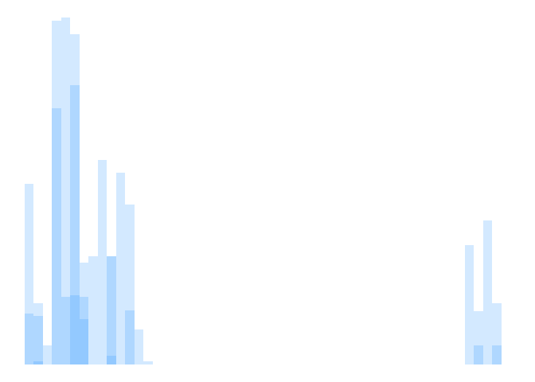
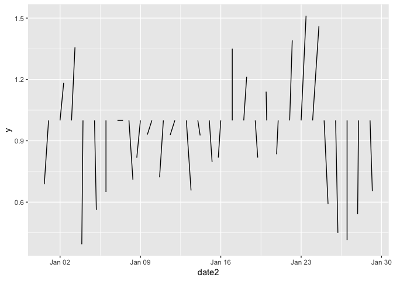
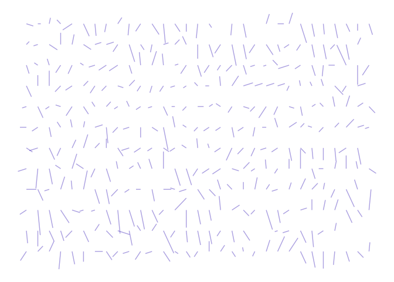
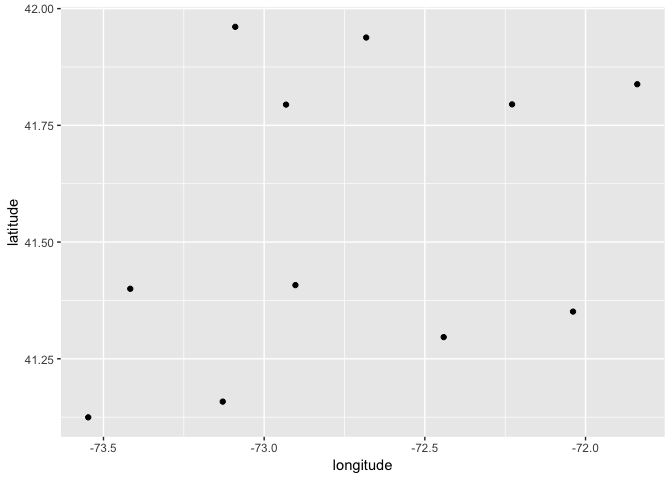
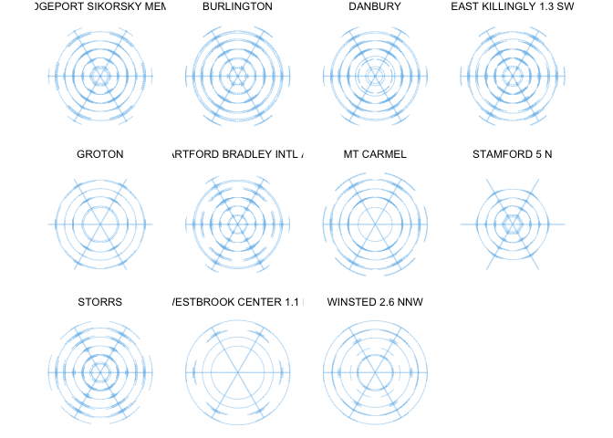
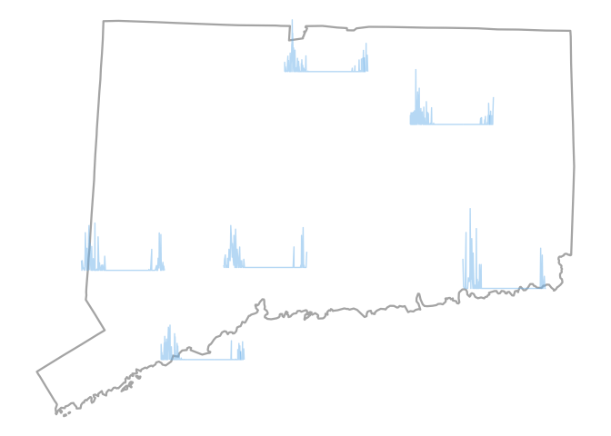
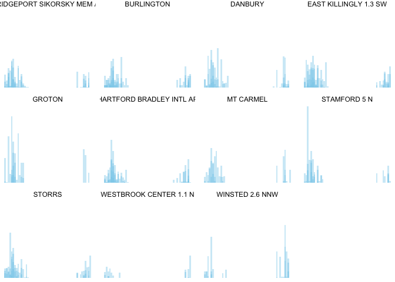
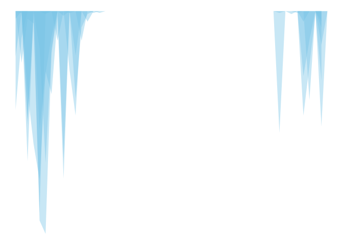
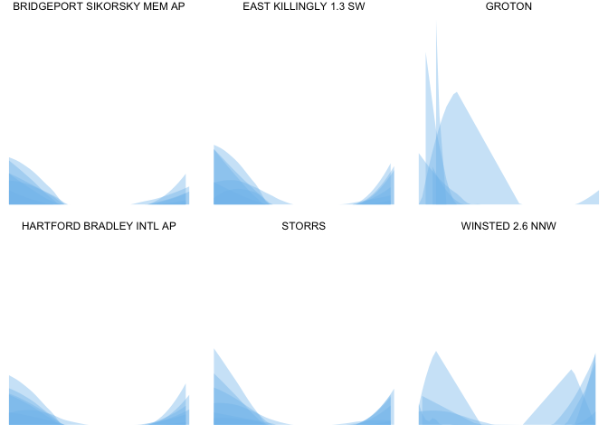

Snowfall
================

    ## # A tibble: 74 x 11
    ##    id    latitude longitude elevation state name  gsn_flag wmo_id element
    ##    <chr>    <dbl>     <dbl>     <dbl> <chr> <chr> <chr>    <chr>  <chr>  
    ##  1 USC0…     41.2     -73.2        43 CT    BRID… ""       ""     TMAX   
    ##  2 USC0…     41.2     -73.2        43 CT    BRID… ""       ""     TMIN   
    ##  3 USC0…     41.2     -73.2        43 CT    BRID… ""       ""     TOBS   
    ##  4 USC0…     41.2     -73.2        43 CT    BRID… ""       ""     PRCP   
    ##  5 USC0…     41.2     -73.2        43 CT    BRID… ""       ""     SNOW   
    ##  6 USC0…     41.2     -73.2        43 CT    BRID… ""       ""     SNWD   
    ##  7 USC0…     41.2     -73.2        43 CT    BRID… ""       ""     WT01   
    ##  8 USC0…     41.2     -73.2        43 CT    BRID… ""       ""     WT03   
    ##  9 USC0…     41.2     -73.2        43 CT    BRID… ""       ""     WT04   
    ## 10 USC0…     41.2     -73.2        43 CT    BRID… ""       ""     WT05   
    ## # ... with 64 more rows, and 2 more variables: first_year <int>,
    ## #   last_year <int>

    ## $meta
    ## $meta$offset
    ## [1] 1
    ## 
    ## $meta$count
    ## [1] 7
    ## 
    ## $meta$limit
    ## [1] 25
    ## 
    ## 
    ## $data
    ##                    uid    mindate    maxdate                        name
    ## 1 gov.noaa.ncdc:C00861 1763-01-01 2018-12-16             Daily Summaries
    ## 2 gov.noaa.ncdc:C00946 1763-01-01 2018-11-01 Global Summary of the Month
    ## 3 gov.noaa.ncdc:C00947 1763-01-01 2018-01-01  Global Summary of the Year
    ## 4 gov.noaa.ncdc:C00821 2010-01-01 2010-01-01     Normals Annual/Seasonal
    ## 5 gov.noaa.ncdc:C00823 2010-01-01 2010-12-31               Normals Daily
    ## 6 gov.noaa.ncdc:C00824 2010-01-01 2010-12-31              Normals Hourly
    ## 7 gov.noaa.ncdc:C00822 2010-01-01 2010-12-01             Normals Monthly
    ##   datacoverage         id
    ## 1            1      GHCND
    ## 2            1       GSOM
    ## 3            1       GSOY
    ## 4            1 NORMAL_ANN
    ## 5            1 NORMAL_DLY
    ## 6            1 NORMAL_HLY
    ## 7            1 NORMAL_MLY
    ## 
    ## attr(,"class")
    ## [1] "ncdc_datasets"

<!-- -->

    ## # A tibble: 53 x 3
    ##    `week(date2)` direction speed
    ##            <dbl>     <dbl> <dbl>
    ##  1             1       211   124
    ##  2             2       256   108
    ##  3             3       190    74
    ##  4             4       183   153
    ##  5             5       267   114
    ##  6             6       239   128
    ##  7             7       236   130
    ##  8             8       260   110
    ##  9             9       234   147
    ## 10            10       271   142
    ## # ... with 43 more rows

<!-- -->

<!-- -->

Map

<!-- -->

<!-- -->

<!-- -->

<!-- -->

<!-- -->

Icicles?

<!-- -->

snow banks

<!-- -->
